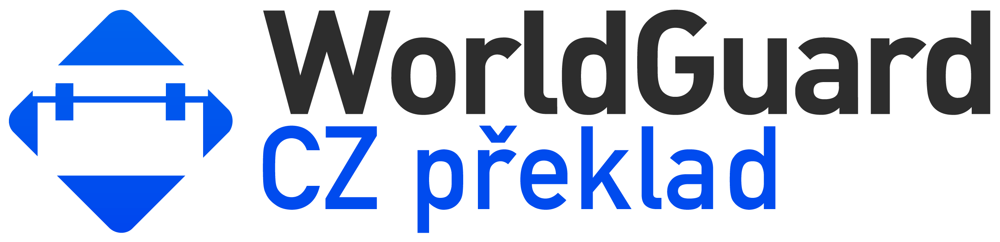

<h1>
     
</h1>

Český překlad známého a velmi používaného pluginu WorldGuard.

WolrdGuard umožňuje majitelům serverů ochránit části mapy před hráči. Navíc umožňuje další
nastavení:

* Brání vybuchování creeperů, witherů, a dalších
* Přidává možnost zabránit šíření lávy, vody, ohně, tvorbě ledu, sbírat endermanům bloky, atd
* Zakázat určité bloky a itemy, aby nemohly být použity
* Upozornit adminy a moderátory, že jsou používány určité bloky
* Ochránit části světa, takže na nich mohou stavět jen povolení hráči
* Povolit, či zakázat PvP, TNT, poškození mobů a další podobné funkce
* Chránit server před vykořisťováním
* Povolit, či zakázat funkce Minecraftu
* Přidání užitečných příkazů, jako okamžitý příkaz pro zastavení šíření všech požárů
* Povolit všechny funkce, jako výchozí jsou zakázány

WorldGuard je open source a je dostupný pod GNU Lesser
General Public License v3.

Pro použití WorldGuard je vyžadována implementace serveru Bukkit (jako [Paper](https://papermc.io)) a [WorldEdit plugin](https://dev.bukkit.org/projects/worldedit). Vydanou kopii WorldGuard můžete získat z [BukkitDev](https://dev.bukkit.org/projects/worldguard). Přeložená verze je dostupná na webu [ValleyCube Jenkins](http://jenkins.valleycube.cz/job/WorldGuard-CZ-preklad).

### UPOZORNĚNÍ! KONTROLA A KOREKCE PŘEKLADU, ABY BYL SROZUMITELNÝ VE HŘE PROBĚHNE V BUDOUCÍCH VERZÍCH

Links
-----

* [Domovská stránka WG](http://enginehub.org/worldguard)
* [Domovská stránka CZ]()
* [Discord WG](https://discord.gg/enginehub)
* [Discord CZ]()
* [Oznámení problémů](https://github.com/The-patik/WorldGuard-CZ-preklad/issues)
* [Sestavení](http://jenkins.valleycube.cz) 
* [Dokumentace EN](https://worldguard.enginehub.org/en/latest/)
